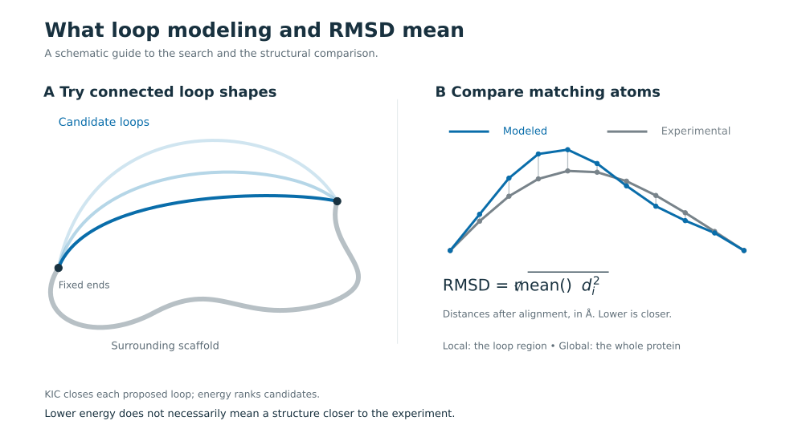
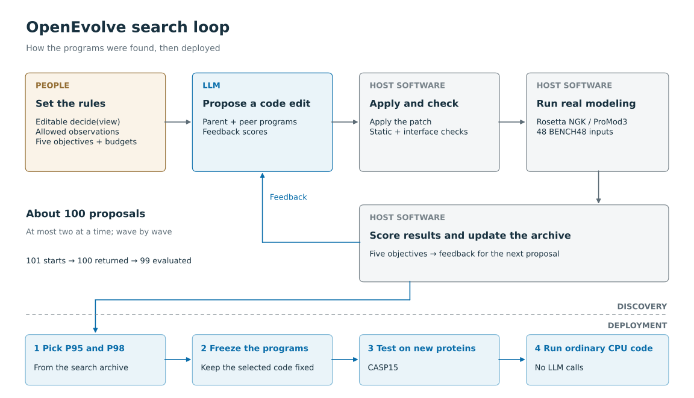
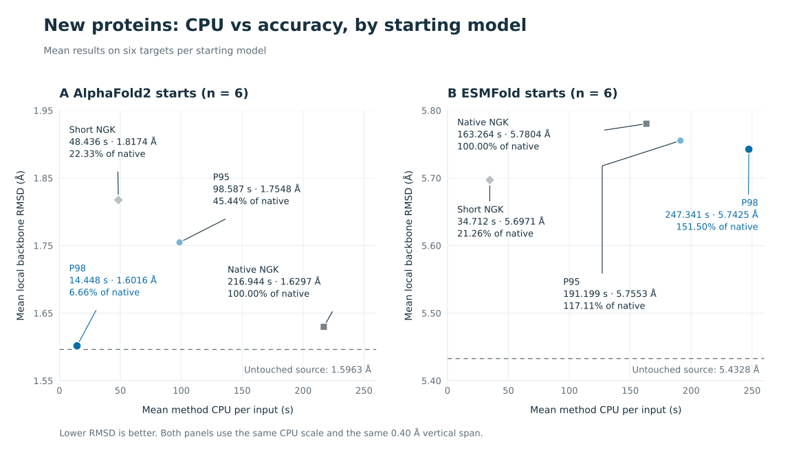

# NGNGK: letting an LLM write the decision rules for protein-loop modeling

NGNGK uses LLM-guided program search to find decision rules for protein-loop modeling. We wanted to know: **can a language model write a small, readable program that decides when to look up a candidate, when to sample a new structure, and when to stop?**

To find out, we had a general-purpose LLM propose about 100 versions of a "decision program" for one well-known protein-modeling procedure (Rosetta's NGK loop modeling). We checked each version, tested it on real proteins, and kept two: P95 and P98. The names just mean they were proposals #95 and #98.

These are not protein AI models. They are ordinary Python code that you can read line by line. Once frozen, they run on a normal CPU without any LLM.

[Research overview](p95-p98/docs/RESEARCH_OVERVIEW.md) · [How they were found](p95-p98/docs/closeout/DISCOVERY.md) · [Development results](p95-p98/docs/closeout/RESULTS.md) · [New-protein results and traces](p95-p98/docs/closeout/casp15/INTERPRETATION.md) · [Install and run](p95-p98/README.md)

## The idea

A protein loop is a segment linking other parts of a protein. To model one, Rosetta's NGK (next-generation kinematic closure) tries many loop shapes, adjusts the sidechains, and scores each candidate by energy. Its Monte Carlo sampling sometimes accepts a worse move so the search can explore instead of getting stuck.



Searching longer can lower the energy without getting any closer to the real, experimental structure. So we let the LLM rewrite only the control: when to look up a candidate in a database, when to sample, which structure to keep, and when to stop. The LLM's weights and Rosetta's energy function stay fixed.



The search loop is built on [OpenEvolve](https://github.com/algorithmicsuperintelligence/openevolve). We added the protein side: what the program sees (the current structure and its own search history, never the experimental answer), what it may control in Rosetta's own Monte Carlo search, how it's scored, and records tying each piece of discovered code to what it actually did.

## What we found

We measure accuracy with RMSD: the average distance, in ångströms (Å), between the model's atoms and the experimental structure. Lower is better.

### 1. On the development set: similar quality, much less work

On BENCH48, the 48 cases we used while searching and selecting, both programs had lower median error than standard NGK while doing far less work. Instead of one long search everywhere, they chose case by case among a database lookup, a rebuild, refinement, and a quick energy minimization.

| Program | Work compared to standard NGK | Geometry-valid structures | Median local error (CA RMSD) |
|---|---:|---:|---:|
| P95 | 16.11% | 48 / 48 | 0.820 Å |
| P98 | 25.13% | 48 / 48 | 0.780 Å |
| Standard NGK | 100% | 47 / 48 | 0.878 Å |

What to keep in mind:

- It isn't an independent test. We chose the programs on this data, and the 48 cases come from only 32 groups of related proteins (homology components).
- On the hard group of cases, both programs had worse raw RMSD than standard NGK. See the [complete report](p95-p98/docs/closeout/RESULTS.md).
- Each program made 11 database lookups, 37 NGK refinements, and 2 NGK rebuilds (one case can use several). We measured the workflow as a whole, not what the lookups contributed on their own.
- "Work" counts the study's logical computation, not seconds. The RMSD here is the display metric used in the table and figure: alpha-carbon (CA) atoms fitted to the surrounding scaffold. It is separate from the frozen raw quality metrics in the complete report, and differs from the metric in the new-protein test below.

[](p95-p98/docs/figures/method_comparison.pdf)

[What the figure shows](p95-p98/docs/figures/CAPTION.md) · [All 144 rows of development data](p95-p98/docs/closeout/results/per_input.csv)

### 2. On new proteins: savings without a database lookup

We then gave the frozen programs six unseen CASP15 targets, each with an existing AlphaFold2 and ESMFold prediction to start from. We fixed both conditions before testing. The programs started directly from these structures (no forced NGK rebuild), and neither chose a database lookup in any run. So any savings come from how they steered Rosetta's own sampling.

**On the AlphaFold2 starts, P98 used 6.66% of the CPU time of standard NGK refining the same starting structures (a "warm start"; 14 s vs. 217 s on average) and got slightly better accuracy (1.602 Å vs. 1.630 Å mean local backbone RMSD).**

The savings came from control decisions, mainly stopping early: all six runs stopped inside NGK after just 0, 0, 13, 2, 0, and 27 KIC attempts (KIC is the step that closes each proposed loop shape). Against a fixed short NGK run, P98 used 29.83% of the CPU and had lower error (1.602 Å vs. 1.817 Å).

| Starting models | P98 CPU (mean) | Standard NGK CPU (mean) | P98 / NGK CPU | Starting model RMSD | P98 RMSD | Standard NGK RMSD |
|---|---:|---:|---:|---:|---:|---:|
| AlphaFold2, 6 targets | 14.45 s | 216.94 s | 6.66% | 1.596 Å | 1.602 Å | 1.630 Å |
| ESMFold, same 6 targets | 247.34 s | 163.26 s | 151.50% | 5.433 Å | 5.743 Å | 5.780 Å |
| All 12 inputs | 130.89 s | 190.10 s | 68.85% | 3.515 Å | 3.672 Å | 3.705 Å |



What it did not do:

- It didn't beat the AlphaFold2 predictions themselves: P98's mean error was 0.0053 Å higher. Pooled over all 12 inputs, all four methods (P95, P98, standard NGK, short NGK) ended with higher mean error than the untouched inputs.
- On the ESMFold starts, P98 used more CPU than standard NGK.
- We can't separate any benefit from changing the Monte Carlo acceptance temperature (its willingness to take worse moves) from the effect of stopping early.
- It's a small test: 48 runs covering six targets with one random seed, so it is not statistical proof.

CPU time covers the modeling run and its observations. It leaves out making the starting predictions, building resources, and final scoring, and it is neither a wall-clock speedup nor the "work" measure above. All 48 outputs passed our existing geometry checks; we skipped MolProbity (a structure-quality checker).

Full numbers, including P95, the short baseline, energies, every target, and repair costs: [CASP15 results](p95-p98/docs/closeout/casp15/INTERPRETATION.md).

## Why this matters

Scientific workflows rely on hand-written rules of thumb. We tested whether program search can turn rules like these into plain code that people can read, test, and argue about. We only tried Rosetta; other biomolecular tools are untested. The [research overview](p95-p98/docs/RESEARCH_OVERVIEW.md) relates this to OpenEvolve, AlphaEvolve, and AI-assisted scientific computing, and shows a real rule from a discovered program.

The search was small and bounded: 101 LLM starts, 100 returned programs, and 99 valid ones that we evaluated. We trained no neural network and didn't test whether a longer search would do better. Our records link each proposal to its scores, the frozen programs, and their decisions on new proteins, including successful edits, a rejected candidate, and one start that never returned an answer. The [discovery account](p95-p98/docs/closeout/DISCOVERY.md) separates what humans framed, what a coding assistant built, and what the automated search found.

## Try it

**Check our records without installing anything heavy** (from `p95-p98/`):

```sh
python3 docs/closeout/discovery/verify.py
python3 docs/closeout/results/summarize.py
python3 docs/closeout/casp15/summarize.py
```

These scripts check the saved records and re-create our summary numbers without Rosetta or an LLM. Raw evidence: [evidence index](p95-p98/docs/closeout/EVIDENCE_INDEX.md) · [Rosetta's own per-run counters](p95-p98/docs/closeout/casp15/mc_control_counts.csv) · [compact callback records](p95-p98/docs/closeout/casp15/mc_control_evidence.json). An [earlier pilot on the General set](p95-p98/docs/closeout/GENERAL_PILOT.md) is a separate, limited comparison run after a shared NGK rebuild.

**Run P95/P98 yourself.** The package is [`p95-p98/`](p95-p98/). You'll need Linux, Python 3.12, the pinned licensed PyRosetta build, and ProMod3 in its own environment. You don't need an LLM account or OpenEvolve.

```sh
git clone --filter=blob:none --sparse --branch codex/p95-p98 https://github.com/Raalmonk/p95-p98.git p95p98-rosetta
cd p95p98-rosetta
git sparse-checkout set p95-p98
cd p95-p98
python -m pip install .
p95p98 verify
```

More details: [installation and inputs](p95-p98/README.md) · [method](p95-p98/docs/METHOD.md) · [validation](p95-p98/docs/VALIDATION.md). The release passed 54 software tests and the public 1L2Y install example; these check the software, not the science. The repo holds the evidence behind the discovery, not a turnkey rerun of the whole search.

## Credits and licenses

- **OpenEvolve** provides the search framework. We didn't invent it.
- **Rosetta** provides the actual physical modeling steps. **ProMod3** provides the database lookup and sampling.
- This repo is a full fork of [RosettaCommons/rosetta](https://github.com/RosettaCommons/rosetta). The original [Rosetta README](README.Rosetta.md) and [license](LICENSE.md) are kept as they were.
- Our own controller and harness code has its [own license](p95-p98/LICENSE), except the scheduler, which is derived from Rosetta. Rosetta's native code and the frozen programs are unchanged. Runtime binaries and databases are not included.
