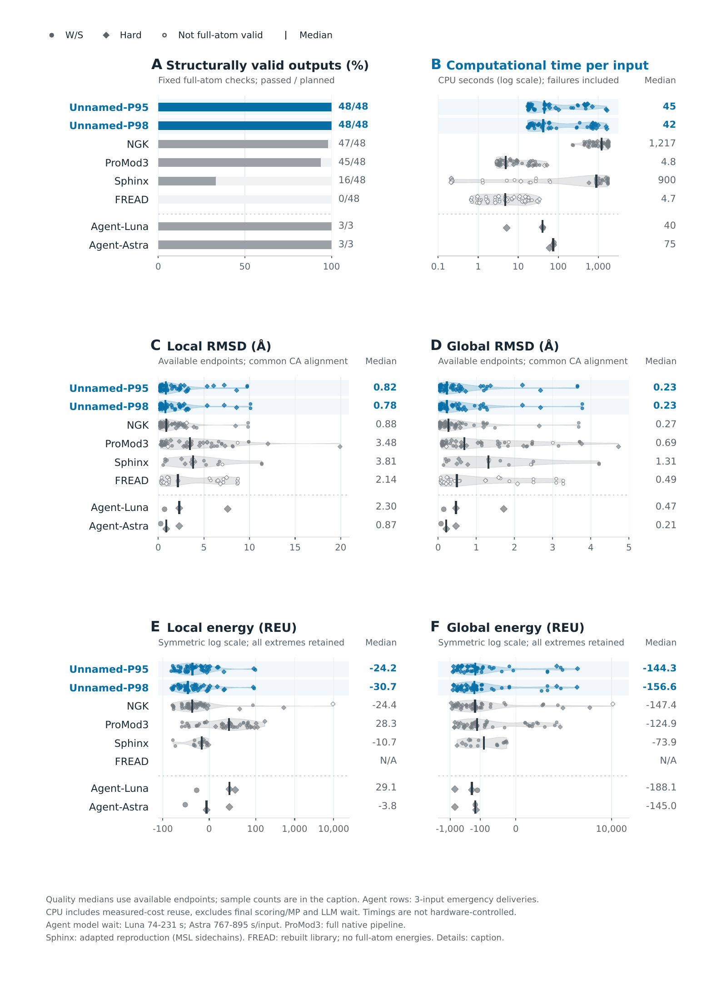
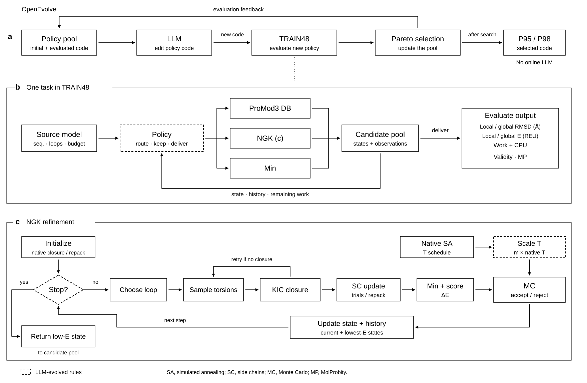

# P95 / P98

**LLM-discovered control programs for budgeted protein loop modeling — from method routing to Monte Carlo stopping.**

P95 and P98 use source-structure observations and search history to choose native modeling operations, retain candidates and stop. An LLM searches for the control code during development; the frozen programs then run on CPUs without an LLM account or OpenEvolve installation.

[Installation and usage](p95-p98/README.md) · [Method](p95-p98/docs/METHOD.md) · [Discovery evidence](p95-p98/docs/closeout/DISCOVERY.md) · [External results and control traces](p95-p98/docs/closeout/casp15/INTERPRETATION.md) · [Source code](p95-p98/src/p95p98)

## Main finding: the benefit is not limited to database retrieval

**On six external CASP15 AlphaFold2 starting models, frozen P98 used 6.66% of native warm-start NGK's measured method CPU, with slightly lower mean local backbone RMSD (1.602 versus 1.630 Å). No database action was taken.** All six runs recorded voluntary stops within NGK refinement, with only **0, 0, 13, 2, 0 and 27 KIC attempts**, respectively.

This provides evidence for useful **control of native Monte Carlo sampling**, particularly early stopping, rather than savings exclusively from fragment retrieval. It does not mean that a new KIC solver or physical energy function was learned. The quality comparison includes the complete frozen program's stopping, retention and minimization choices; individual causal contributions have not been isolated by ablation.

### External test: two starting-model conditions, both reported

The same six targets each have an existing AlphaFold2 and ESMFold prediction: 12 inputs, four frozen methods, one fixed seed, 48 completed runs. Inputs enter the policy before any structural search; there is no compulsory common NGK reconstruction. The two model-source strata and primary P98 candidate were specified before the results.

| Starting models | Mean P98 CPU | Mean native NGK CPU | P98 / NGK CPU | Source local RMSD | P98 local RMSD | Native NGK local RMSD |
|---|---:|---:|---:|---:|---:|---:|
| **AlphaFold2, 6 targets** | **14.45 s** | **216.94 s** | **6.66%** | 1.596 Å | **1.602 Å** | 1.630 Å |
| ESMFold, same 6 targets | 247.34 s | 163.26 s | 151.50% | 5.433 Å | 5.743 Å | 5.780 Å |
| All 12 inputs | 130.89 s | 190.10 s | 68.85% | 3.515 Å | 3.672 Å | 3.705 Å |

On the AlphaFold2 stratum, P98 also used **29.83% of the short-NGK control's CPU**, with lower mean local RMSD (1.602 versus 1.817 Å). Against full NGK, five of six AlphaFold2 cases had lower local RMSD and one had higher local RMSD. **The comparison is to additional NGK refinement, not to AlphaFold2 prediction itself:** P98's mean local RMSD was 0.0053 Å above the unprocessed AlphaFold2 sources. No average accuracy improvement over AlphaFold2 or statistical equivalence is claimed.

The ESMFold stratum exposes the limit: several P98 trajectories continued much longer, and their observation/control overhead outweighed sampling savings. P98 was more expensive than full NGK in that stratum. All four methods had worse pooled mean local RMSD than leaving the source predictions unchanged. Energy and RMSD tradeoffs, P95, the short control, every target and all original repair costs are included in the [full tables](p95-p98/docs/closeout/casp15/REPORT.md) and [interpretation](p95-p98/docs/closeout/casp15/INTERPRETATION.md).

CPU ratios use paired total **method CPU**, including host/observation work but excluding upstream prediction, one-time resource building and final evaluation. They are not wall-clock speedups or BENCH48 logical-work ratios. All 48 outputs passed the project's existing geometry checks; MolProbity was skipped. This is a small six-target, one-seed external pilot, not universal validation.

## Development benchmark: routing and sampling control together

[](p95-p98/docs/figures/method_comparison.pdf)

BENCH48 contains 48 development inputs from 32 homology components and was used during program discovery and selection. It offers database, native rebuilding/refinement and lightweight processing routes. Each frozen program recorded **11 database invocations, 37 NGK-refinement invocations and two NGK-rebuild invocations** across the panel; actions can co-occur. The aggregate savings are not an isolated estimate of the database contribution.

| Method | Geometry-valid / planned | Total logical work / NGK | Accounted route CPU (s) | Median local CA RMSD | Median global CA RMSD |
|---|---:|---:|---:|---:|---:|
| P95 | 48 / 48 | **16.11%** | 9,974.949 | 0.820 Å | 0.226 Å |
| P98 | 48 / 48 | **25.13%** | 14,903.911 | 0.780 Å | 0.225 Å |
| Native NGK | 47 / 48 | 100% | 55,905.890 | 0.878 Å | 0.267 Å |

These RMSDs use the common scaffold-fit CA display definition, not the distinct CASP15 local-backbone metric or transformed training objectives. Hard-group raw RMSD regressions and the invalid NGK endpoint remain in the [development report](p95-p98/docs/closeout/RESULTS.md). Logical work is not seconds; accounted CPU preserves historical measured-cost reuse. Neither metric includes the cost of discovering the programs. The earlier informal “8%” claim for BENCH48 is withdrawn; the verified fractions are shown above.

[Vector figure](p95-p98/docs/figures/method_comparison.pdf) · [Figure definitions](p95-p98/docs/figures/CAPTION.md) · [144-row development data](p95-p98/docs/closeout/results/per_input.csv) · [Development action coverage](p95-p98/docs/closeout/results/action_coverage.json)

## What was discovered, and what remains native?



The mutable object was a Python `decide(view)` function. Its rules select actions, retain outer candidates, inspect search progress and request safe stops. Within NGK, the policies retain native acceptance or request a conditional temperature multiplier of 0.75. The external result above directly supports stopping behavior; it does **not** isolate a benefit from temperature changes or prove a superior annealing schedule.

KIC closure, structural moves, packing, minimization and native low-energy return remain provided by Rosetta; ProMod3 supplies the database and sampling operations. This is optimization of how existing scientific tools are used, not replacement of their underlying physics.

The [discovery record](p95-p98/docs/closeout/DISCOVERY.md) includes a 101-proposal ledger, real parent-to-child patches, retained prompts/responses, a rejected candidate and a consumed model call with no answer. It distinguishes human problem formulation and interface engineering from LLM-proposed control code. P95/P98 were frozen before the external test. These records establish traceability, not an advantage of LLM search over every human or random-search alternative.

## Inspect or recompute without running protein models

From `p95-p98/`:

```sh
python3 docs/closeout/discovery/verify.py
python3 docs/closeout/results/summarize.py
python3 docs/closeout/casp15/summarize.py
```

The commands verify retained patch/identity joins and reproduce numerical summaries from shipped data; they do not call an LLM, run Rosetta or replay the full stochastic discovery process. [Per-policy MC counters](p95-p98/docs/closeout/casp15/mc_control_counts.csv) and [compact native evidence](p95-p98/docs/closeout/casp15/mc_control_evidence.json) make the stopping result inspectable. Callback samples are explicitly sparse; terminal operation counters are not inferred from their length.

The [earlier General pilot](p95-p98/docs/closeout/GENERAL_PILOT.md) is retained as a separate, conditional post-reconstruction comparison. It is not combined with CASP15 or silently discarded. [Evidence index](p95-p98/docs/closeout/EVIDENCE_INDEX.md).

## Run

The installable package is in [`p95-p98/`](p95-p98/). It requires Linux Python 3.12, the pinned licensed PyRosetta build, and a separately configured ProMod3 environment. Dependency versions, source-excluded database construction and the public input example are documented in the [installation guide](p95-p98/README.md).

```sh
git clone --filter=blob:none --sparse --branch codex/p95-p98 https://github.com/Raalmonk/p95-p98.git p95p98-rosetta
cd p95p98-rosetta
git sparse-checkout set p95-p98
cd p95-p98
python -m pip install .
p95p98 verify
```

Both installed policies completed the public 1L2Y example. The published release passed 54 software tests and a native ProMod3 database/compatibility check. [Example outputs and receipts](p95-p98/examples/outputs/summary.json) are installation evidence, separate from the benchmarks. This documentation update does not change native or policy code, and does not publish the unqualified local accounting/storage work.

## Rosetta source and license

This is a full fork of [RosettaCommons/rosetta](https://github.com/RosettaCommons/rosetta). The release branch starts at the compatible Rosetta commit `5e498f1409c68ade56c8ce5842bf79e1b02e8db4`; its native source is unchanged. The original [Rosetta README](README.Rosetta.md) and [license](LICENSE.md) are retained. Original controller/harness code has its own [license](p95-p98/LICENSE), which excludes the Rosetta-derived scheduler. Runtime binaries and separately obtained databases are not bundled in the package.
