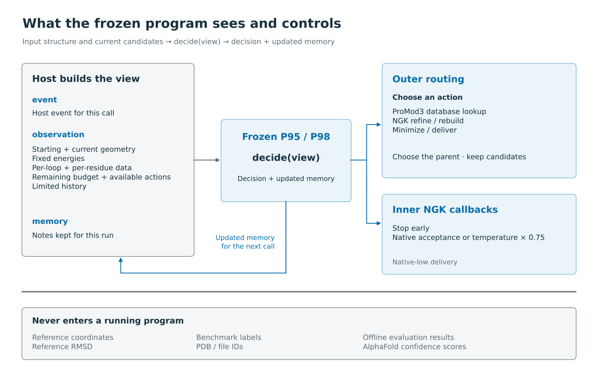

# How P95 and P98 run

P95 and P98 are frozen decision programs. They never call an LLM when they run.

The host program calls `decide(view)` and passes three things in the view:

- `event`: the host event for this call.
- `observation`: facts computed only from the input structure and current candidates.
- `memory`: notes the program keeps for this run.

The program returns a decision, which controls the next operation, plus updated memory. That memory carries over between the two levels where the program makes choices:

- **Outer routing.** The program picks an available action and the parent structure to start from, keeps candidates in its outer state slots, or delivers a final structure.
- **Inner callbacks inside NGK** (Rosetta's next-generation KIC loop modeling; KIC is kinematic closure, a way of moving a loop while keeping it connected). Here the program can stop the native run early, and can choose either native acceptance or a temperature multiplier of 0.75.

Both programs keep `native_low` delivery. Neither uses custom inner save/restore, overrides the acceptance probability directly, or uses non-native KIC perturbations.

## What the program can see

The host builds observations only from the supplied input structure and the current candidates: geometry, fixed energies, and per-loop and per-residue information. "Source displacement" is measured against the original supplied structure.

Runtime views never contain reference coordinates, reference RMSD (root-mean-square deviation from a known answer), benchmark labels, or offline evaluation results. Building an observation must not change the native random number stream.

Two input rules matter:

- Native loop definitions use one-based pose indices. Observation loop intervals and residue indices are zero-based. The host must convert once and check that both point to the same residues.
- Fixed local energy is summed over a declared local energy region. That region is an explicit input, not something inferred from a target structure.

The fixed score is ref2015, with backbone hydrogen bonds split into pair energies. NGK's own active score changes during a run and has a different job. Keep the two scores separate in observations.

## Random numbers and commits

An operation starts from the chosen parent's coordinates and the current route's random number generator (RNG). Picking an older parent from an outer slot does not reset the RNG.

When an operation succeeds, we commit its coordinates, RNG state, and policy memory together. Native-low recovery follows the native protocol. It does not mean "reset the RNG to an earlier candidate".

When an operation fails without committing:

- The last committed endpoint stays available.
- The cost of the failed attempt stays on the record.

To resume, the retained operation state must be unambiguous. A recorded intent alone does not prove the operation succeeded or that it is safe to replay.

## Budgets

We track three separate quantities: recorded CPU time, elapsed wall time, and calibrated logical work. The original BENCH48 runs used input-specific logical prices ("tariffs"), physical CPU protection, caps on the number of actions, and reserves held back for delivery.

A portable runtime must name its work profile in its output. If you run the exact same policy with a different tariff, you will not reproduce the original trajectory, because decisions depend on the budget.

A portable work profile should contain:

- the four kernel prices: `kic`, `repack`, `rotamer_trials`, `minimize`
- prices for observation, controller, archive and restore
- policy setup work
- where each value came from

Each original kernel price is the measured kernel CPU divided by the operation count, multiplied by (net refinement CPU / summed measured kernel CPU).

You can keep an exact historical price profile and use it on a new input without reading any benchmark inputs. If you do, call it a reference tariff, not a calibration for the new input.

Never fill missing prices with zero or arbitrary unit costs. Both programs use absolute work thresholds, and P95 also decides whether to repeat a descent based on how much of the original allowance it has used.

## Native dependency

The integration needs the legacy NGK callback interface that the host uses. A stock NGK call without the inner callbacks does not run the full policy.

Runtime receipts should record: the native build, interface version, score profile, policy hash, input and loop bindings, random seed, and budget profile.

## Small public example

PDB [1L2Y](https://www.rcsb.org/structure/1L2Y), model 1, chain A, is a public 20-residue Trp-cage structure suitable for a small execution example. PDB archive data are released under [CC0](https://www.rcsb.org/pages/usage-policy).

Use a declared internal loop and keep the source file's identity: record where it was downloaded from and do not alter it. The example shows loading, routing and output. It does not need a target structure or any measurement against a reference.
