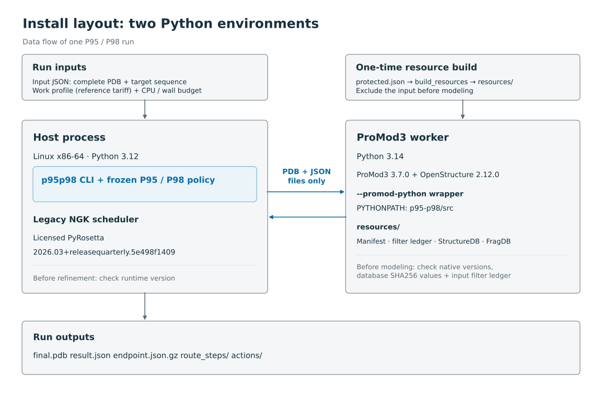

# ProMod3: runtime and resources

P95 and P98 require ProMod3. Its worker fills loops either by searching a structure database or by Monte Carlo sampling. This page covers how to install it, how to build its database for your input, and how it behaves at run time.

## Versions

| Component | Version |
|---|---|
| ProMod3 | 3.7.0, upstream commit `6817e1819152078d2d0ab9fa1fd053d8057d4454` (unmodified) |
| OpenStructure | 2.12.0 |
| Python for these libraries | 3.14 |
| OpenStructure build image | `registry.scicore.unibas.ch/schwede/openstructure@sha256:9f2669ffde16c45939fc6e8e6dd4f907697301c081edf3d97d464c034a421d19` |

The worker checks the ProMod3 and OpenStructure versions before modeling. Our evaluated runtime built ProMod3 against the OpenStructure image above and used Python 3.14. PyRosetta and ProMod3 can live in separate Python environments, because the two processes only exchange PDB and JSON files.



## Install ProMod3

1. Get ProMod3 from its [official repository](https://git.scicore.unibas.ch/schwede/ProMod3), under its own license. Follow the [upstream build instructions](https://openstructure.org/promod3/3.7.0/).
2. Check out and build the exact source with these options:

   ```sh
   git clone https://git.scicore.unibas.ch/schwede/ProMod3.git ProMod3
   git -C ProMod3 checkout 6817e1819152078d2d0ab9fa1fd053d8057d4454
   cmake -S ProMod3 -B ProMod3/build -DOST_ROOT=/path/to/ost-2.12.0 \
     -DOPTIMIZE=1 -DENABLE_SSE=1 -DDISABLE_DOCUMENTATION=1 \
     -DBoost_PYTHON_VERSION=3.14 -DCMAKE_INSTALL_PREFIX=/path/to/promod3-3.7.0
   cmake --build ProMod3/build --parallel 4
   cmake --install ProMod3/build
   ```

   The compiler, Boost.Python, Eigen and OpenMM development packages must match your OpenStructure installation. The pinned upstream container provides the compatible setup we used.
3. Install the main controller package with Python 3.12. Its package metadata deliberately rejects other Python versions.
4. Do not install the main package with the Python 3.14 interpreter. Instead, put this release's `src` directory on `PYTHONPATH` for the ProMod3 process. The worker imports only the standard-library `p95p98.promod` subtree plus the native ProMod3 and OpenStructure modules.

   One way to do this: write a wrapper script, pass it to the CLI as the ProMod3 Python command, have it export `PYTHONPATH=/path/to/p95-p98/src:/path/to/native/site-packages`, and then run the native Python 3.14 interpreter with `"$@"`.
5. Set `OST_ROOT`, the library loader path, and `PROMOD3_SHARED_DATA_PATH` to match your installation. `PROMOD3_SHARED_DATA_PATH` points to the directory that holds `loop_data`, `scoring_data` and `sidechain_data`.

The launcher pins native thread counts to one.

## Upstream data

This repository ships no third-party libraries or databases. ProMod3's upstream source and install data provide the original StructureDB, fragment database (FragDB), torsion samplers, scoring tables and rotamer libraries.

Check what you downloaded with `sha256sum` before building resources:

| File | SHA256 | Size (bytes) |
|---|---|---:|
| Upstream 3.7.0 StructureDB | `0f1c6e35a3f248fddd0c2c0da2c0d1145b502d4663fe8adb7239f27adad3301a` | 520676726 |
| Upstream FragDB | `c8edc3828d7e3faaa0e1f2b7fc5ed2d5ebeb9482fe2b0e417e98c0d235f5b5f8` | 305574667 |

## Build a library that excludes your input

The database must exclude your input protein and any sequences that pass the identity threshold below. `python -m p95p98.promod.build_resources` reuses our existing resource builder to do this:

- It aligns sequences with the same native C++ global alignment (three-state, affine gaps, BLOSUM62), gap costs -11/-1, and ties broken by score, then matches, then negative gaps.
- It excludes a database entry when `matches * 5 >= min(lengths) * 2`, and it excludes the whole PDB entry, not just one chain.
- It rebuilds the matching native FragDB for fragment lengths 3–14, with 1 Å distance bins, 20-degree angle bins and a 1 Å RMSD cutoff.

Building the library uses no reference coordinates.

Steps:

1. Write `protected.json` from your source and target sequence(s). Add lowercase PDB entry IDs when you know them:

   ```json
   {"entries": [], "sequences": [{"label": "input", "sequence": "ACDEFGHIKLMNPQRSTVWY"}]}
   ```

   That sequence only shows the format. Replace it with your real input sequence. Include any known source PDB entry IDs in `entries`.
2. In the ProMod3 environment, with `PM3_DATA` set to the upstream shared-data directory, run:

   ```sh
   c++ -O3 -shared -fPIC src/p95p98/promod/identity.cpp -o identity.so
   python -m p95p98.promod.build_resources --protected protected.json \
     --identity-library ./identity.so --structure-db "$PM3_DATA/loop_data/structure_db.dat" \
     --output resources --workers 4
   ```

3. Keep the output directory together. It contains `resources.json`, `filter-ledger.json`, both databases and a completion receipt, and the manifest uses relative paths.

Building the databases is one-time preparation. Its CPU time is recorded separately from inference. These files are resources you supply, not a cache of structure results.

Before modeling, the worker loads both databases explicitly and checks their SHA256 values and the filter ledger. The ledger must explicitly protect your input's complete target and source sequence. A manifest built for a different input is rejected before any model is built.

### The original BENCH48 library

The library used for the BENCH48 evaluation excluded all the development sources combined and held 13334 coordinate records.

| Item | SHA256 |
|---|---|
| StructureDB | `eeaa2d9d8cb6e327da2b2fea44b1dea73d51cee8cd927290011679ffe1fd615f` |
| FragDB | `806f9bb2ecf738798945291effadb484df6110e6660c5e977f06ebeb9115ae7d` |
| Ledger | `ea4163715f9d6e8731c0f1fc7013036fec23948425acad80e0cf81f21d545474` |

A library built for a new input will have its own hashes. Using the same policy files does not give you the same candidate resources, and it will not reproduce the evaluation numbers.

## How a ProMod3 action runs

### Preparing the input

Every ProMod3 action starts again from the original gap structure built from the input.

`prepare_source(source_pdb, sequence, loops, output_dir)` takes a complete, canonical input whose residue sequence equals the target sequence. `loops` is a list of `start`/`stop` dictionaries with one-based, inclusive pose indices. The function removes the requested loop coordinates, builds the native target/template alignment, and keeps the input's segment boundaries.

It rejects:

- missing residues
- mismatches between target and source
- loops at either end of the chain
- alternate conformers
- insertion codes
- indexed nonstandard chemistry

So if your target has insertions, you need to prepare a complete source before using this release's inference entry point.

### Modeling

1. `FillLoopsByDatabase` or `FillLoopsByMonteCarlo` runs with ProMod3's original native defaults.
2. If gaps remain, the branch returns `PARTIAL_MODEL` and no eligible final structure.
3. A complete model goes through `ReconstructSidechains` (keeping existing sidechains), native `MinimizeModelEnergy`, then `CheckFinalModel`.

We do not call `BuildSidechains`, because its ring-punch repair can start additional searches. Output chain labels are restored, and residue numbers use one-based pose indices.

### Limits and failures

The process launcher records CPU and wall time for each action. It caps each action at 1800 CPU seconds and 5400 wall seconds (the evaluated limits), or less if the caller has less budget left. It never reruns an interrupted attempt automatically.

- `SIGXCPU` is reported as `CPU_LIMIT`.
- An unexplained `SIGKILL` is reported as `KILLED_UNKNOWN_CAUSE`, even if the observed CPU use was close to the limit.
