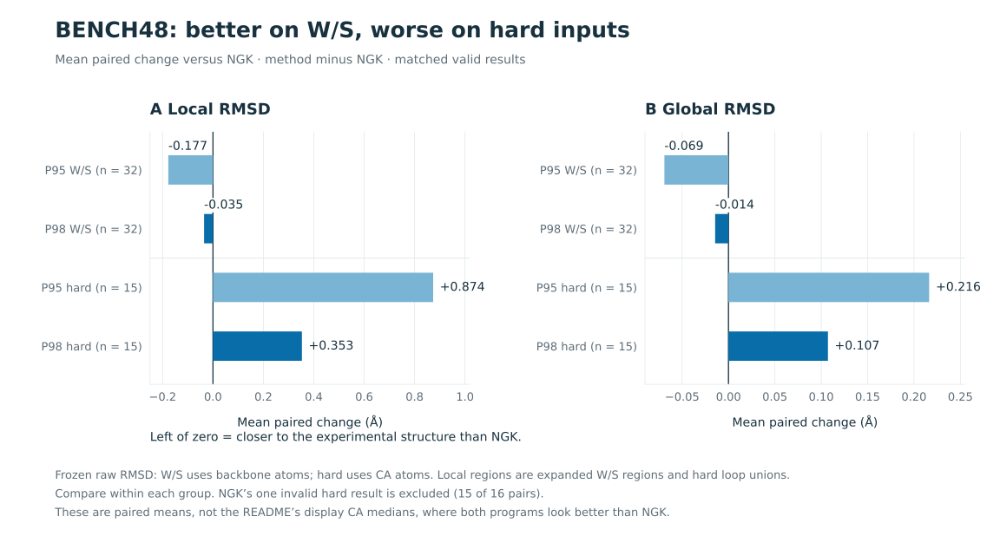
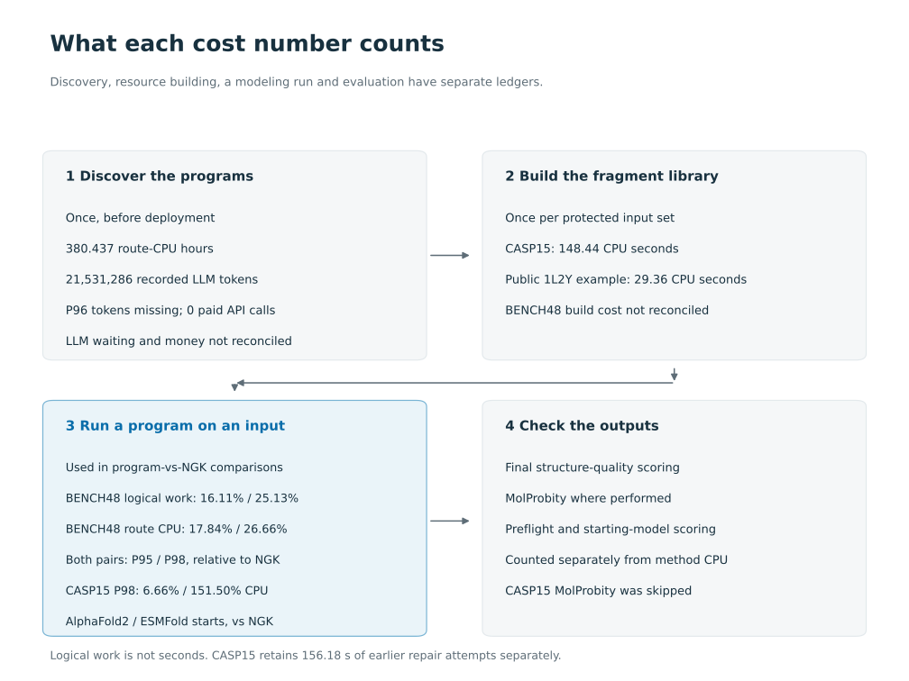

# Results: BENCH48 development data

**On the 48 development inputs, P95 used 16.11% and P98 used 25.13% of the total logical work of standard NGK** (Rosetta's next-generation kinematic closure loop modeling). Both returned 48 valid structures; NGK returned 47. The quality picture is a trade-off. P98 beat NGK on all five scoring objectives, but both programs had worse raw RMSD on the hard group. (RMSD, root-mean-square deviation, measures how far a model is from the true structure, in Å.)

One caveat applies to all the BENCH48 results: we used this same data to discover and select the programs, so it is not an independent test.

[](../figures/method_comparison.pdf)

**Correction:** we previously said P98 was "8%" faster. We withdraw that. No retained comparison supports it: not total costs, not median per-input ratios, not ratios of medians. The verified figure is that P98 cut total logical work by 74.87%.

## Where the numbers are, and how to regenerate them

- [TABLES.md](results/TABLES.md): the main raw averages, three different cost ratios, and paired changes on valid inputs by subgroup.
- [per_input.csv](results/per_input.csv): all 144 method-by-input rows, including NGK's one invalid result. It has the original raw values, the separate scaffold-fit RMSDs used for display, CPU components, wall time and final-structure identities.

All four raw quality metrics exist for 48/48 rows per method. When paired with NGK on inputs where both results are valid, there are 47 pairs overall: 32 in the W/S groups and 15 in the hard group. The inputs are not 48 independent proteins. There are 32 homology components (groups of related proteins): the W and S inputs are 32 starts from 16 components, and the hard inputs are 16 more components.

To regenerate the tables and a machine-readable summary, run this from the release root. It needs only Python's standard library and reads only the shipped CSV:

```sh
python3 docs/closeout/results/summarize.py
```

Behind that, a private script, `artifacts/NGNGK_CLOSEOUT/results/extract_retained.py`, pulled these numbers from the saved figure CSV. It checked each input and final-structure hash against the original manifest, and checked the original group averages and logical/route CPU totals against the final reports. [provenance.json](results/provenance.json) records those sources. The script did not reopen the remote structure files or recompute coordinates. The full original file locators and hashes stay in the CSV, minus host and account paths.

## The five scoring objectives

These are the original objectives we froze before the search. Each is transformed so higher is better, balanced across homology components, and unitless. They are stored in [frozen_axes.csv](results/frozen_axes.csv), apart from the newer descriptive arithmetic in the main table. We do not average them into one score or name a new winner.

| Method | Local RMSD axis | Global RMSD axis | Local energy axis | Global energy axis | Efficiency axis |
|---|---:|---:|---:|---:|---:|
| P95 | 0.518163 | 0.500362 | 0.518219 | 0.438657 | 0.878308 |
| P98 | 0.499389 | 0.490022 | 0.547624 | 0.465248 | 0.824536 |
| NGK | 0.465555 | 0.460504 | 0.467521 | 0.461339 | 0.317161 |

What to notice:

- P95 scores below NGK on the global energy axis (worse, since higher is better).
- On hard inputs where both results are valid, both programs have worse (higher) local and global RMSD than NGK.
- NGK's raw average energy over all inputs includes one extreme, geometrically invalid result. The both-valid subgroup table shows energy regressions that a pooled average can hide.



NGK had one failure. Its row 36 hit its CPU limit (a CPU_LIMIT action) and returned a geometrically invalid structure. Row 35 also had a CPU_LIMIT action but returned a valid one. Both rows' costs and outputs stay in the data. P95 and P98 had no failed results here. All three methods finished the 15-part MolProbity diagnostic set on all 48 inputs. Finishing the diagnostics does not mean no problems were found.

## Cost boundaries



| Method | Retained measured route CPU (s) | Reused preparation (s) | Accounted route CPU (s) | Final quality receipt CPU (s) | MP receipt CPU (s) | Sum active wall (s) | Sum worker wait (s) |
|---|---:|---:|---:|---:|---:|---:|---:|
| P95 | 9960.670 | 14.279 | 9974.949 | 7.537 | 5.439 | 9619.366 | 692.649 |
| P98 | 14889.631 | 14.279 | 14903.911 | 7.281 | 1.289 | 14525.217 | 130.638 |
| NGK | 55891.610 | 14.279 | 55905.890 | 7.025 | 1776.579 | 55316.972 | 6162.233 |

Each column has 48 recorded rows per method.

- Accounted route CPU is the measured route CPU plus exactly measured preparation work reused at rows 17 and 35. It includes failed attempts.
- NGK reused 46 whole routes, keeping their original CPU cost. Its `incremental_run_cpu_seconds` sums to 3520.462 s, versus 9960.670 s (P95) and 14889.631 s (P98) in their original runs. Those fields come from different historical runs, so they are not a fair speed ratio, and they are not new CPU used for this report. This report ran no structure computations.
- The MP columns are recorded MolProbity scoring and retrieval costs, including reuse. They do not mean MolProbity was fully rerun for every structure. [evaluation_costs.csv](results/evaluation_costs.csv) keeps the report fields and row counts.
- Neither final scoring nor MolProbity is part of the route CPU comparison.
- We keep per-input active wall time and queue wait separately. Input wall times overlap, so adding them up does not give the batch's elapsed time.
- Timings are historical. This was not a controlled hardware speed test.
- Logical work uses the original hybrid cost definition. It is not CPU seconds, and it is not the newer draft mode that prices actions independent of the clock.

**Discovery costs are separate from running the programs.** All proposal evaluations recorded 380.437 route CPU hours, 372.876 of them beyond P1. The three strong comparison methods recorded another 19.631 hours. The 100 returned-program summaries add 761.163 s of final-quality CPU and 32915.071 s of MolProbity CPU, including the invalid-program fallback and reuse. These are scoring accounts, not reconciled new server usage. The 100 known usage receipts total 21,531,286 tokens; P96's usage is missing. The search ran on an existing subscription with zero paid API calls. We don't have a reconciled total for LLM wait time during discovery, one-time resource building, or a currency bill; those stay null in [discovery_costs.json](results/discovery_costs.json). None of these one-time costs or model wait is included in route CPU.

## Metric definitions

Frozen raw RMSD (`legacy_local_rmsd_A` / `legacy_global_rmsd_A` in the CSV) is defined differently for the two input types:

- W/S inputs: backbone atoms N, CA, C and O. The model and the reference are each aligned to the same visible scaffold anchors from the starting structure, then errors are measured with no further fitting. Local covers the frozen expanded region L. Global covers every residue in the final sequence.
- Hard inputs: CA atoms only, with explicit residue matching. Model and reference are each aligned to fixed non-loop anchors from the raw starting structure. Local covers the union of loops; global covers all matched residues.

Pairs are matched by input index, episode and homology component, never by nearest value.

Because the pooled RMSD averages mix these two definitions, we show them only so the arithmetic can be traced. To judge raw quality, use the paired changes by group. For a single cross-group number, use the clearly labeled common CA display metric.

Display RMSD (`local_rmsd_A` / `global_rmsd_A` in the existing figure) is a different, derived metric. It fits the model directly onto the reference with one Kabsch alignment over all matched non-loop CA atoms, then measures CA RMSD over the loop union (local) and all matched atoms (global) using that same fit. We copied these values unchanged so they match the figure. They do not replace the frozen objectives.

Energies use Rosetta's fixed ref2015 score with backbone hydrogen-bond pair decomposition, in Rosetta energy units (REU). Local energy sums weighted per-residue contributions over the frozen local region (expanded L for W/S, loop union for hard). Global energy covers the whole structure. The CSV's residue counts record these boundaries.

Geometry validity uses fixed checks on sequence, heavy atoms, chemistry and connectivity, and geometry. Low RMSD, low energy, and finished MolProbity diagnostics are separate observations.

## CASP15 supplement: new proteins from predicted starts (8 October 2026)

**We also read this test as separating sampling control from database lookup, because no program chose a database action.** On the six AlphaFold2 starting models, frozen P98 used 6.66% of the CPU of standard warm-start NGK (14.448 vs. 216.944 seconds per input). Its mean local backbone RMSD was 1.6016 Å vs. 1.6297 Å for NGK. All six of P98's refinement runs show a voluntary stop. This is evidence of useful control over sampling without database lookup. It is not proof that P98 learned a new Monte Carlo algorithm or a better annealing schedule.

Two important limits:

- The AlphaFold2 starting models themselves averaged 1.5963 Å. We don't claim P98 improved on them on average.
- On ESMFold starts, the compute advantage disappeared: P98 used 151.50% of NGK's CPU.

The [full interpretation, split by starting model, with modeling counters and limitations](casp15/INTERPRETATION.md) adds detail the pooled table below doesn't show.

The test used six proteins, each with an existing AlphaFold2 and ESMFold prediction. That gives 12 inputs × 4 methods × one fixed seed (seed20261007) = 48 runs. All 48 results passed the saved geometry-validity flag. MolProbity was skipped. No method started from a shared NGK reconstruction step: the programs made their decisions without a common NGK rebuild run first. These are six proteins, not 12 independent ones. This test does not replace the earlier nine-protein General experiment or the BENCH48 tables above.

| Method | Geometry-valid / planned | Mean method CPU (s) | Mean local backbone RMSD (Å) |
|---|---:|---:|---:|
| P95 | 12 / 12 | 144.893 | 3.755 |
| P98 | 12 / 12 | 130.894 | 3.672 |
| native_NGK | 12 / 12 | 190.104 | 3.705 |
| short_NGK | 12 / 12 | 41.574 | 3.757 |

Pooled across both starting models:

- The unchanged starting structures averaged 3.514533 Å local RMSD, better than every method's pooled average.
- P95 and P98 used less average CPU than native_NGK and more than short_NGK. This does not show that P95 or P98 beats leaving the predictions unchanged.
- Both programs recorded 12 ngk_refine and 10 minimize actions and no database actions, so this panel does not test whether database lookup helps repair structures.
- Results by starting model and by protein remain visible in the linked files.

The table counts outer method CPU from the successful current attempt. Earlier repair attempts, in original record order, add 156.182618 CPU seconds, kept separately by method. Building shared resources took 148.439991 CPU seconds, counted once. Preflight and scoring of starting and final structures are separate from method CPU. The exact [48-row CSV](casp15/results_per_input.csv) and [report](casp15/REPORT.md) give mean, median and total costs, prior and cumulative costs, global RMSD, both energies, paired changes from the starting structures, and separate AlphaFold2 and ESMFold summaries.
