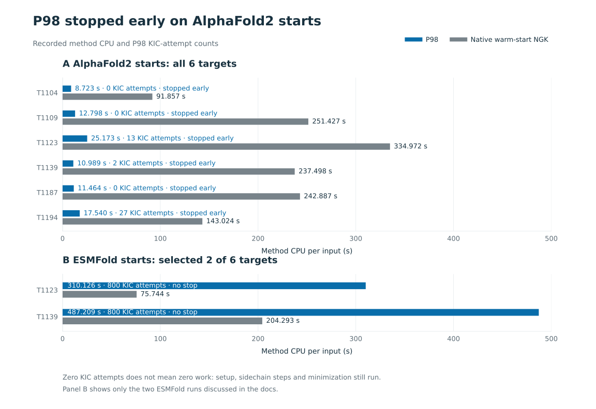

# Beyond database lookups: P98's control of the NGK search

**P98's savings don't come only from database lookups.** None of the 24 P95/P98 runs here chose a database lookup. Starting from the six AlphaFold2 models, the frozen P98 program used 6.66% of the CPU time of standard NGK refinement, with slightly lower average local error. In all six runs, P98 chose to stop the search early.

Terms:

- **NGK** ("next-generation KIC") is Rosetta's standard loop-modeling method, a Monte Carlo search that tries many random loop changes and keeps or rejects each.
- **KIC** (kinematic closure) is NGK's move: reshape the loop while keeping it attached to the protein.
- **RMSD** (root-mean-square deviation) is how far a model is from the real structure, in ångströms (Å). Lower is better.
- **CPU time** is processor time used, in seconds.

This is evidence that an LLM can discover useful rules for controlling a Monte Carlo search on new proteins, especially when to stop. We do not claim it invented a new loop-closing solver, energy function or Monte Carlo algorithm, or that P98 improves every starting structure.

## Two different tests

**BENCH48** ([results](../RESULTS.md)) tests the full programs on 48 development inputs drawn from 32 groups of related proteins. Here the programs can choose among all their actions. Each program made 11 database lookups, 37 NGK refinements and 2 NGK rebuilds. Minimization ran 44 times for P95 and 48 times for P98. One run can include several actions. These [action counts](../results/action_coverage.json) were extracted from the original proposal summaries, not from a new experiment.

On BENCH48, P95 and P98 used 16.11% and 25.13% of the total logical work of matched NGK runs. Lookups are cheap, but these totals don't separate savings from lookups, early stopping or other choices. It would be wrong to say the programs mostly just returned a database result.

**CASP15** asks a narrower question: does a frozen program still save work when it doesn't use the database? On AlphaFold2 starting models, yes. On ESMFold starting models, not consistently. We did no retraining and did not choose between programs based on this test. P98 was named the main candidate before any results, and we report P95 and both kinds of starting model too.

## Results on new proteins

We used six CASP15 targets (T1104, T1109, T1123, T1139, T1187, T1194). Each has two existing predictions, one from AlphaFold2 and one from ESMFold. We ran four methods on each of the 12 starting models with one fixed seed (20261007), for 48 runs. The loops are 6 to 9 residues long. Unlike the earlier General pilot, no NGK rebuild of the loop was needed before the program's first decision. The two baselines refine the same input structures directly with standard NGK ("warm-start"), using five outer cycles (native) or one (short).

| Starting models | Method | Mean method CPU (s) | CPU / native NGK | Mean local backbone RMSD (Å) |
|---|---|---:|---:|---:|
| AlphaFold2, n=6 | Unprocessed source | No additional modeling | — | 1.5963 |
| AlphaFold2, n=6 | P95 | 98.587 | 45.44% | 1.7548 |
| AlphaFold2, n=6 | **P98** | **14.448** | **6.66%** | **1.6016** |
| AlphaFold2, n=6 | Native warm-start NGK | 216.944 | 100% | 1.6297 |
| AlphaFold2, n=6 | Short warm-start NGK | 48.436 | 22.33% | 1.8174 |
| ESMFold, n=6 | Unprocessed source | No additional modeling | — | 5.4328 |
| ESMFold, n=6 | P95 | 191.199 | 117.11% | 5.7553 |
| ESMFold, n=6 | **P98** | **247.341** | **151.50%** | **5.7425** |
| ESMFold, n=6 | Native warm-start NGK | 163.264 | 100% | 5.7804 |
| ESMFold, n=6 | Short warm-start NGK | 34.712 | 21.26% | 5.6971 |
| All inputs, n=12 | Unprocessed source | No additional modeling | — | 3.5145 |
| All inputs, n=12 | P95 | 144.893 | 76.22% | 3.7551 |
| All inputs, n=12 | **P98** | **130.894** | **68.85%** | **3.6721** |
| All inputs, n=12 | Native warm-start NGK | 190.104 | 100% | 3.7050 |
| All inputs, n=12 | Short warm-start NGK | 41.574 | 21.87% | 3.7573 |


How to read the ratios:

- Each ratio compares total CPU across the paired runs, not medians.
- The 6.66% figure belongs to this AlphaFold2 pilot only. It is not a corrected version of the older "8%" claim, which was never supported.
- BENCH48 reports logical work (a calibrated work measure, not CPU seconds). CASP15 reports measured CPU time. They are different units, so don't compare them directly.

**AlphaFold2 starts: P98 stayed close to the starting accuracy while using a fraction of NGK's CPU, but did not improve on AlphaFold2 on average.** Compared with full NGK, P98 had lower local RMSD on five of six inputs and higher on one. Compared with the untouched AlphaFold2 models, two got better, two were unchanged at the reported precision, and two got worse. The average change was +0.0053 Å. Energy results were not consistently better than the baselines. All energies and global RMSDs are in the [full report](REPORT.md).

**ESMFold starts are a real limit, not a subgroup we set aside.** There, P98 cost 1.515 times as much as full NGK, and its mean local RMSD was 0.310 Å worse than the starting model. Across both kinds of starting model, all four methods ended up with higher mean local RMSD than leaving the input alone. So these results do not support refining every predicted structure by default.

## The program really did stop sampling

Rosetta's final counters show this directly, not just shorter run times. On AlphaFold2 starts:

| Target | P98 KIC attempts | Voluntary native-stage stop | P98 CPU (s) | Native NGK CPU (s) |
|---|---:|---|---:|---:|
| T1104 | 0 | Yes | 8.723 | 91.857 |
| T1109 | 0 | Yes | 12.798 | 251.427 |
| T1123 | 13 | Yes | 25.173 | 334.972 |
| T1139 | 2 | Yes | 10.989 | 237.498 |
| T1187 | 0 | Yes | 11.464 | 242.887 |
| T1194 | 27 | Yes | 17.540 | 143.024 |

Notes on this table:

- Zero KIC attempts doesn't mean zero work. Setup, sidechain steps and (when chosen) the outer minimization step still run.
- All six runs finished normally. None timed out.
- The stopping rules never saw the reference RMSD or AlphaFold's confidence scores.

**On some ESMFold starts, P98 didn't stop, and those runs cost more than native NGK.** On T1123 and T1139, P98 made 800 KIC attempts each with no voluntary stop. It made 4,433 and 4,437 controller calls and 7,208 and 7,116 observation-scoring calls. These runs took 310.126 and 487.209 seconds, versus 75.744 and 204.293 seconds for native NGK. These records suggest that when P98 keeps a long search going, its own observing and deciding can add a lot of overhead. We did not run a profiling experiment that splits the cost by part.



The released programs also include a rule that sometimes multiplies the acceptance temperature by 0.75 (a lower acceptance temperature makes a Monte Carlo search less likely to accept worse moves). This pilot does not show any benefit from that rule, and does not show a better annealing schedule. Its logged samples are sparse, not a full count of how often it fired. What we show directly is that P98 stopped and made fewer KIC attempts. The accuracy comparison covers the whole frozen program, including its choices about minimization and which result to keep.

## Recompute and inspect

Run these from the package directory:

```sh
python3 docs/closeout/casp15/summarize.py
python3 docs/closeout/discovery/verify.py
```

The first command checks that the per-run data and trace records line up, and recomputes the tables. It does not run Rosetta, an LLM or a policy. The second checks the saved discovery records.

Data files, each with exact hashes of their sources:

- [Per-run numbers, 48 rows](results_per_input.csv)
- [Rosetta counters for the 24 P95/P98 runs](mc_control_counts.csv)
- [Compact trace evidence](mc_control_evidence.json). This was extracted from stored run records. It is not a newly generated log.

Inputs came from [Bhattacharya-Lab/CASP15](https://github.com/Bhattacharya-Lab/CASP15/tree/96687bc0f6e117240015766bb7c4d8b11ec796cd) and [KarmaLoop](https://github.com/karma211225/KarmaLoop/tree/962557be5d1efc9ff37dcd4f2002a4c534c44567/example/CASP15). We reused their existing predictions and did not run AlphaFold or ESMFold ourselves.

We picked targets using target and loop metadata, plus a screen against 896 sequences we had recorded as off-limits. We did not pick them based on results. A target was excluded if it matched a listed sequence at 30% or more identity, with at least 80% of each sequence aligned. This doesn't rule out distant relatives or exposure we don't know about.

## What counts as cost, and other caveats

- Method CPU includes the policy program and its observations. It excludes making the original predictions, the one-time library build, and final evaluation.
- The [full report](REPORT.md) lists other costs separately: 156.183 seconds of earlier attempts to repair record order, 148.440 seconds of resource building, plus preflight and evaluation.
- All 48 outputs passed our existing geometry checks. MolProbity was skipped, not passed.
- Six independent targets, one random seed.
- The earlier [General pilot](../GENERAL_PILOT.md) is a separate, limited experiment. This test does not replace it.

## How we measured

- The evaluator matches each model to the reference structure residue by residue, using an explicit sequence mapping.
- Local RMSD uses the backbone atoms (N, CA, C, O) in a window around the loop, after aligning on the N, CA and C atoms of the flanking residues.
- Global CA RMSD uses its own alignment over all matched CA atoms.
- Reference atoms that are missing are left out. We never fill them in from the prediction.
- Energies use the existing fixed ref2015 export (Rosetta's standard energy function), summed over the loop and over the whole protein.
- These metrics are not the same as the scaffold-fit CA numbers shown for BENCH48.
- We did not change any geometry, scoring or alignment definition for this write-up.
